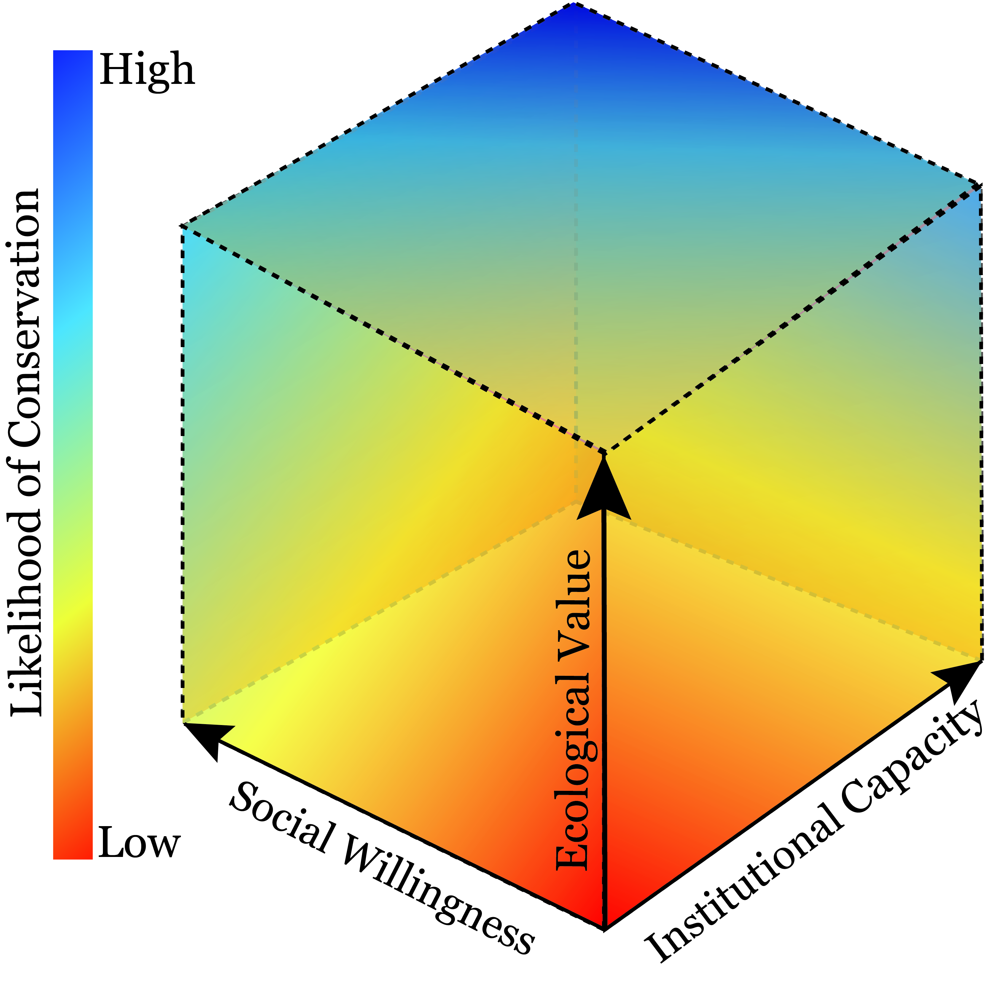

```{r setup, include=FALSE}
knitr::opts_chunk$set(warning = FALSE, message = FALSE, 
                      fig.retina = 3, fig.align = "center")
```


```{r packages-data, include=FALSE}
library(tidyverse)
library(pander)
```


name: 1
class: center middle main-title section-title-4

# Welcome to Space!!

.class-info[

**Session 1**

.light[HES597: Introduction to Spatial Data in R<br>
Boise State University Human-Environment Systems<br>
Fall 2021]

]

---

name: outline
class: title title-inv-5

# Plan for today

--

Introductions

--

Why (not) R?

--

Orientation to the course

--

Parting thoughts


---

layout: false
name: introductions
class: center middle section-title section-title-2 animated fadeIn

# Introductions
---

class: title title-inv-5

# Introductions

A bit about me

---
# Introductions

.pull-left.center[
<figure>
  
  <figcaption>from Williamson et al. 2018</figcaption>
</figure>
]

.pull-right[

- Crooked paths

- My research

- Why I teach this class
]
---
# Introductions

A bit about you

- Where are you from?

- What is your research?

- What do you like most about Boise? 

- What do you miss most about "home"?

---

layout: false
name: why-not-r
class: center middle section-title section-title-2 animated fadeIn

# Why (not) R?
---

class: title title-inv-5

# Why R?
.pull-left[

- Open Source


- Integrated analysis pipelines


- Reproducible workflows
]
.pull-right[
```{r echo=FALSE, fig.height=6, fig.width=6}

library(maps)
library(socviz)
library(tidyverse)
party_colors <- c("#2E74C0", "#CB454A") 
us_states <- map_data("state")
election$region <- tolower(election$state)
us_states_elec <- left_join(us_states, election)
p0 <- ggplot(data = us_states_elec,
             mapping = aes(x = long, y = lat,
                           group = group, fill = party))
p1 <- p0 + geom_polygon(color = "gray90", size = 0.1) +
    coord_map(projection = "albers", lat0 = 39, lat1 = 45) 
p2 <- p1 + scale_fill_manual(values = party_colors) +
    labs(title = "Election Results 2016", fill = NULL)
p2

```
]
---
class: title title-5

# Why R?
.pull-left[
```{r echo=TRUE}

library(maps)
library(socviz)
library(tidyverse)
party_colors <- c("#2E74C0", "#CB454A") 
us_states <- map_data("state")
election$region <- tolower(election$state)
us_states_elec <- left_join(us_states, election)
p0 <- ggplot(data = us_states_elec,
             mapping = aes(x = long, y = lat,
                           group = group, fill = party))
p1 <- p0 + geom_polygon(color = "gray90", size = 0.1) +
    coord_map(projection = "albers", lat0 = 39, lat1 = 45) 
p2 <- p1 + scale_fill_manual(values = party_colors) +
    labs(title = "Election Results 2016", fill = NULL)

```
]
.pull-right[
```{r echo=FALSE, fig.height=6, fig.width=6}
p2
```
]
---
.pull-left[
```{r}
p0 <- ggplot(data = subset(election, st %nin% "DC"),
             mapping = aes(x = r_points,
                           y = reorder(state, r_points),
                           color = party))
p1 <- p0 + geom_vline(xintercept = 0, color = "gray30") +
    geom_point(size = 2)
p2 <- p1 + scale_color_manual(values = party_colors)
p3 <- p2 + scale_x_continuous(breaks = c(-30, -20, -10, 0, 10, 20, 30, 40),
                              labels = c("30\n (Clinton)", "20", "10", "0",
                                         "10", "20", "30", "40\n(Trump)"))

```
]
.pull-right[
```{r echo=FALSE, fig.height=7, fig.width=7}
p3 + facet_wrap(~ census, ncol=1, scales="free_y") +
    guides(color=FALSE) + labs(x = "Point Margin", y = "") +
    theme(axis.text=element_text(size=8))
```
]
---

# Why Not R?

Coding can be hard...

--

Memory challenges

--

Speed

--

Decision fatigue
---
layout: false
name: class-details
class: center middle section-title section-title-2 animated fadeIn

# Class Details
---

class: middle

# Logistics

- Tuesdays - generally a lecture with some live coding demonstrations
- Thursdays - "lab" to work through the example, work on the assignments, get help
- [Course Webpage](http://isdrfall21.classes.spaseslab.com/)
- Class during COVID

---

# The Syllabus

.pull-left[
- Expectations (Yours and Mine)
- Course Design
- Projects
]

.pull-right[
```{r assignments-grades, include=FALSE}
assignments <- tribble(
  ~Points,  ~Assignment,
  14 * 15 , "Exercises (14 × 15)",
  50      , "Mini project 1",
  50      , "Mini project 2",
  100     , "Final project"
) %>%
  mutate(Percent = Points / sum(Points),
         Percent = scales::percent(Percent, accuracy = 1))
grading <- tribble(
  ~Grade, ~Range,  ~Grade1, ~Range1,
  "A",  "90–100%", "D",  "60–69%",
  "B",  "80–89%",  "F",  "< 60%",
  "C", "70–79%", "", ""  
)
```

```{r show-assignments-table, echo=FALSE}
assignments_total <- tibble(Assignment = "Total",
                            Points = sum(assignments$Points),
                            Percent = NA)
bind_rows(assignments, assignments_total) %>% 
  select(Assignment, Points, Percent) %>% 
  pandoc.table(justify = "lcc", missing = "—")
```
]
---
class: middle

# R, RStudio, and Git

- We'll use RStudio server to minimize setup troubleshooting (you should still have R on your machine)

- Data, code, and assignments managed via GitHub classroom (we'll go through all of this on Thurs)

- This is going to be a team effort!! (check out the [Resources](/resource/) for info on getting started)
---
# Data types and structures in R

  - R has 6 basic data types

--
    - character, numeric, integer, logical, and complex
--
  - R has __A LOT__ of different data structures

--
    - vectors, data frames, tibbles, lists, and matrices
--
  - R even has special object types

--
    - stanfit, grobs, lm
--
  - Knowing the kind of data and structure it's in helps guide coding
  
  - Spatial data often in lists, matrices, tibbles, and special objects
  
  - We'll explore the implications of different data structures for accessing, modifying, and plotting in our first lab
---
class: middle

# Parting Thoughts
- Am I making a map or running an analysis
- What is the goal of my analysis or figure?
- Is the spatial arrangement important?

---
# Before next time
- Sign up for github (and send me your username)
- Enter your seat number in my.boisestate.edu
- Verify that you are able to login to the RStudio server with the VPN