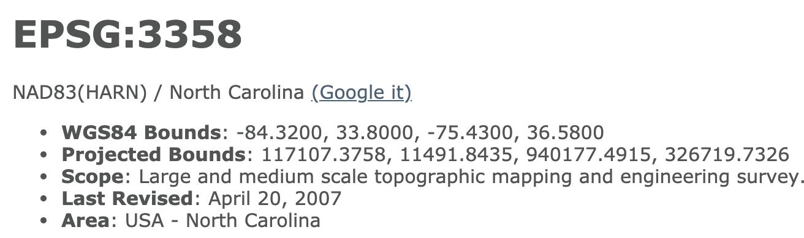
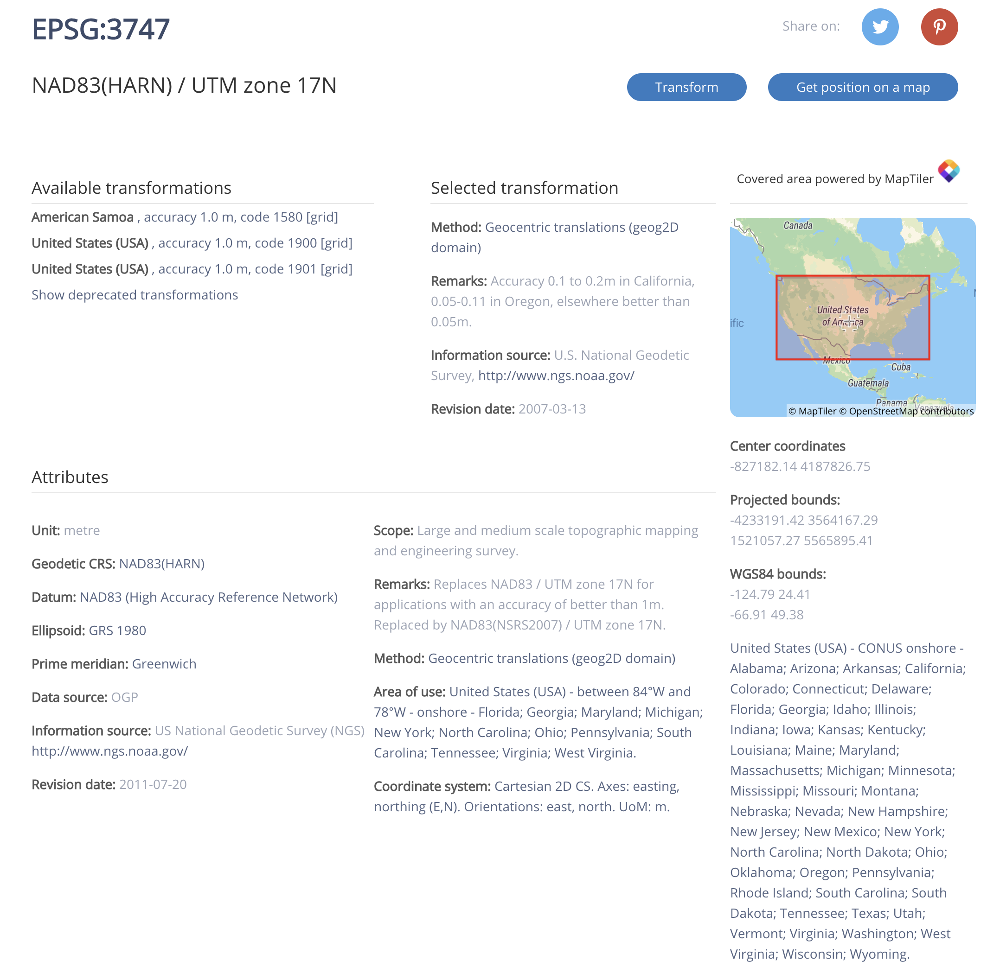

```{r setup, include=FALSE}
knitr::opts_chunk$set(warning = FALSE, message = FALSE, 
                      fig.retina = 3, fig.align = "center")
```


```{r packages-data, include=FALSE}
library(tidyverse)
library(pander)
```


name:1
class: center middle main-title section-title-4

# Spatial data is special data

#### (Or - how does R keep track of all of this spatial stuff?)

.class-info[

**Session 3**

.light[HES597: Introduction to Spatial Data in R<br>
Boise State University Human-Environment Systems<br>
Fall 2021]

]

---

class: title title-inv-5

# Plan for today

--

Location, Location, Location

--

The Coordinate Reference System

--

Other elements that define location in R objects

--

Parting thoughts


---

# Questions we can answer with GIS

 - Questions about geographic location
 
 - Questions about geographic distribution
 
 - Questions about geographic association
 
 - Questions about geographic interaction
 
 - Questions about geographic change

---

# Questions we can answer with GIS

 .primary[- __Questions about geographic location__]
 
 .white[
 - Questions about geographic distribution
 
 - Questions about geographic association
 
 - Questions about geographic interaction
 
 - Questions about geographic change
 ]

---

layout: false
name: projections
class: center middle section-title section-title-2 animated fadeIn

# Location, Location, Location!!
### __(sure, but how do we actually describe where things are?)__
---

class: center middle

# Location
---
class: left middle

# Location

--

## __nominal: (potentially contested) place names__

--

## __absolute: the physical location on the earth's surface__

---
class: left middle

# Location


.white[## __nominal: (potentially contested) place names__]

## __absolute: the physical location on the earth's surface__

---
# Coordinates: 2 or more measurements that specify location relative to a _reference system_

.pull-left[
- Cartesian coordinate system: grid formed by combining horizontal (*x*) and vertical (*y*) measurement scales

- _origin (O)_ = the point at which both measurement systems intersect

- By convention this is equal (0,0) and all measurements relative to the origin

- Adaptable to multiple dimensions (e.g. *z* for altitude)
]

.pull-right.center[
<figure>
  
  <figcaption><a href="https://commons.wikimedia.org/wiki/File:CartesianCoordinateSystem.png">Svjo</a>, <a href="https://creativecommons.org/licenses/by-sa/4.0">CC BY-SA 4.0</a>, via Wikimedia Commons</figcaption>
</figure>
]
---

# Coordinates: 2 or more measurements that specify location relative to a _reference system_

.pull-left.center[
<figure>
  
  <figcaption><a href="https://commons.wikimedia.org/wiki/File:Latitude_and_Longitude_of_the_Earth_fr.svg">Djexplo</a>, CC0, via Wikimedia Commons</figcaption>
</figure>
]

.pull-right[

- Geographic coordinate system uses longitude (*x*) and latitude (*y*) 

- Horizontal location measured as longitude in degrees from prime meridian

- Vertical location measured as latitude in degrees from equator

- _Graticule_: the grid formed by the intersection of longitude and latitude

- The graticule is based on an ellipsoid model of earth's surface and contained in the _datum_

]
---

# Geographic Coordinate Systems: representing the earth's surface in lattitude and longitude

### __Geographic Coordinate Systems define *where* the data is located on the earth's surface__  

  - Generally round or ellipsoid so records location in angular units (e.g., degrees)
  - Multiple GCS because earth's surface is not perfectly round or smooth

### __The *datum* describes which ellipsoid to use and the precise relations between locations on earth's surface and Cartesian coordinates__

  - Geodetic datums (e.g., `WGS84`): origin is based on the earth's center of gravity not optimized for any region.
  
  - Local datums (e.g., `NAD83`): allows for local variation in earth's surface to be modeled more accurately 


---
# Projected Coordinate Systems (CRS)

### __Projected Coordinate Systems describe *how* the data should be translated to a flat surface__

  - Necessary because maps, computer screens, and most R data structures are flat
  - Records locations in linear units (e.g., meters)
  - Three developable surfaces: planar (poles), conic (mid-latitudes), cylindrical (whole earth)
  
### __Projection necessarily induces some form of distortion (tearing, compression, or shearing__
   
   - Some projections minimize distortion of angle, area, or distance
   - Others attempt to avoid extreme distortion of any kind 
   - Distortions particularly challenging for raster data
   
### __How might you choose which projection you should use?__   
---
name: crs
# The Coordinate Reference System (CRS)

- The __CRS__ stores all of the necessary information for the projection calculations

- Includes: Datum, ellipsoid, units, and other information (e.g., False Easting, Central Meridian) to further map the projection to the GCS

- Not all projections have/require all of the parameters

- R stores these data in several formats ([EPSG](https://epsg.io/), [Proj](https://proj.org/), and [WKT](https://www.ogc.org/standards/wkt-crs]))

- Lots of projection info available at [spatialreference.org](https://spatialreference.org/)
---
# The Coordinate Reference System

### PROJ4 (deprecated)

`+proj=eqc +lat_ts=0 +lat_0=0 +lon_0=0 +x_0=0 +y_0=0 +datum=WGS84 +units=m +no_defs`

### EPSG

`EPSG:4087`

### WKT

`PROJCS["WGS 84 / World Equidistant Cylindrical",GEOGCS["WGS 84",DATUM["WGS_1984",SPHEROID["WGS 84",6378137,298.257223563,AUTHORITY["EPSG","7030"]],AUTHORITY["EPSG","6326"]],PRIMEM["Greenwich",0,AUTHORITY["EPSG","8901"]],UNIT["degree",0.0174532925199433,AUTHORITY["EPSG","9122"]],AUTHORITY["EPSG","4326"]],PROJECTION["Equirectangular"],PARAMETER["latitude_of_origin",0],PARAMETER["central_meridian",0],PARAMETER["false_easting",0],PARAMETER["false_northing",0],UNIT["metre",1,AUTHORITY["EPSG","9001"]],AXIS["X",EAST],AXIS["Y",NORTH],AUTHORITY["EPSG","4087"]]`

---
# The Coordinate Reference System (CRS)
Using WGS84 World Equidistant Cylindrical

.pull-left[
```{r ncexample1}
library(sf)
nc.sf <-  st_read(
  system.file("shapes/", package="maptools"), 
  "sids")
nc.sf <- nc.sf %>% 
  st_set_crs(4267) %>% 
  st_transform(4087)
#plot(st_geometry(nc.sf))
```
]

.pull-right[
```{r plotproj1, echo=FALSE}
plot(st_geometry(nc.sf))
```

]
---
# The Coordinate Reference System (CRS)
Using NAD27 a local geodetic datum for North America

.pull-left[
```{r ncexample2}
library(sf)
nc.sf <-  st_read(
  system.file("shapes/", package="maptools"), 
  "sids")
nc.sf <- nc.sf %>% 
  st_set_crs(4267) 
#plot(st_geometry(nc.sf))
```
]

.pull-right[
```{r plotproj2, echo=FALSE}
plot(st_geometry(nc.sf))
```

]
---
# The Coordinate Reference System (CRS)
Using NAD83 adjusted for North Carolina

.pull-left[
```{r ncexample3}
library(sf)
nc.sf <-  st_read(
  system.file("shapes/", package="maptools"), 
  "sids")
nc.sf <- nc.sf %>% 
  st_set_crs(4267) %>% 
  st_transform(3358)
#plot(st_geometry(nc.sf))
```
]

.pull-right[
```{r plotproj3, echo=FALSE}
plot(st_geometry(nc.sf))
```

]
---
# The Coordinate Reference System (CRS)
Using UTM Zone 17N

.pull-left[
```{r ncexample4}
library(sf)
nc.sf <-  st_read(
  system.file("shapes/", package="maptools"), 
  "sids")
nc.sf <- nc.sf %>% 
  st_set_crs(4267) %>% 
  st_transform(3747)
#plot(st_geometry(nc.sf))
```
]

.pull-right[
```{r plotproj4, echo=FALSE}
plot(st_geometry(nc.sf))
```
]

---
.pull-left[
<figure>
  
</figure>

<figure>
  
</figure>
]

.pull-right[
<figure>
  
</figure>

<figure>
  
</figure>
]
---
# Accessing the CRS of Spatial* objects

The `sp` and `rgdal`packages are foundational to the `R` spatial ecosystem


.pull-left[
```{r ncspex, message=FALSE}
library(sp)
library(rgdal)
nc.sp <-  readOGR(
  system.file("shapes/", package="maptools"), 
  "sids", verbose = FALSE)
```
]

.pull-right[

```{r ncspproj}
proj4string(nc.sp)
proj4string(nc.sp) <- CRS("+init=epsg:4267")
proj4string(nc.sp)
nc.sp.proj <- spTransform(nc.sp, CRS("+init=epsg:3747"))
proj4string(nc.sp.proj)
```
]


The warning message you see is a function of the recent change from proj4 to proj6; details are [here](https://cran.r-project.org/web/packages/rgdal/vignettes/PROJ6_GDAL3.html)

---
name: elements
# Other important spatial attributes: Extent and Resolution

- **Extent** describes the area covered by the analysis

- **Resolution** describes the smallest unit being mapped

- Often combined (ambiguously) to describe the _scale_ of an analysis

---

# Extent in `R`

`R` has a very specific definition of extent: the rectangular region encompassed by the data

.pull-left[
### For polygons
```{r sfextent, out.width="50%"}
nc.sf <-  st_read(
  system.file("shapes/", package="maptools"), 
  "sids", quiet = TRUE)

plot(st_geometry(nc.sf))
```
]

.pull-right[
### For rasters
```{r rastext, out.width="50%"}
library(raster)
f <- system.file("external/test.grd", package="raster")
r <- raster(f)
plot(r)
```
]

---

# Extent in `R`

.pull-left[
### For polygons
```{r sfext2}
nc.sf <-  st_read(
  system.file("shapes/", package="maptools"), 
  "sids", quiet = TRUE)
nc.sf %>% 
  st_set_crs(4267) %>% 
  st_transform(3358) %>% 
  st_bbox()

```
]

.pull-right[
### For rasters
```{r rastext2, out.width="20%"}
library(raster)
f <- system.file("external/test.grd", package="raster")
r <- raster(f)
extent(r)
origin(r)
```
]

---

# Resolution in `R`

- Thematically defined for `vector` datasets

- Based on pixel-size for `raster` datasets

```{r rastres}
library(raster)
f <- system.file("external/test.grd", package="raster")
r <- raster(f)
crs(r)
res(r)
```

---

class: center middle
# Getting a quick look at your data

---

```{r splook}
nc.sp
```

---

```{r sflook}
nc.sf
```

---

```{r rastlook}
r
```

---
# Final considerations

- `R` is **flexible**: you can manipulate most of these attributes

- The changes you make need to be **coherent** (often requires multiple changes)

- CRS choices for visualization are about accuracy, honesty, and clarity

- CRS choices for analysis based on consistency and minimizing locational error 