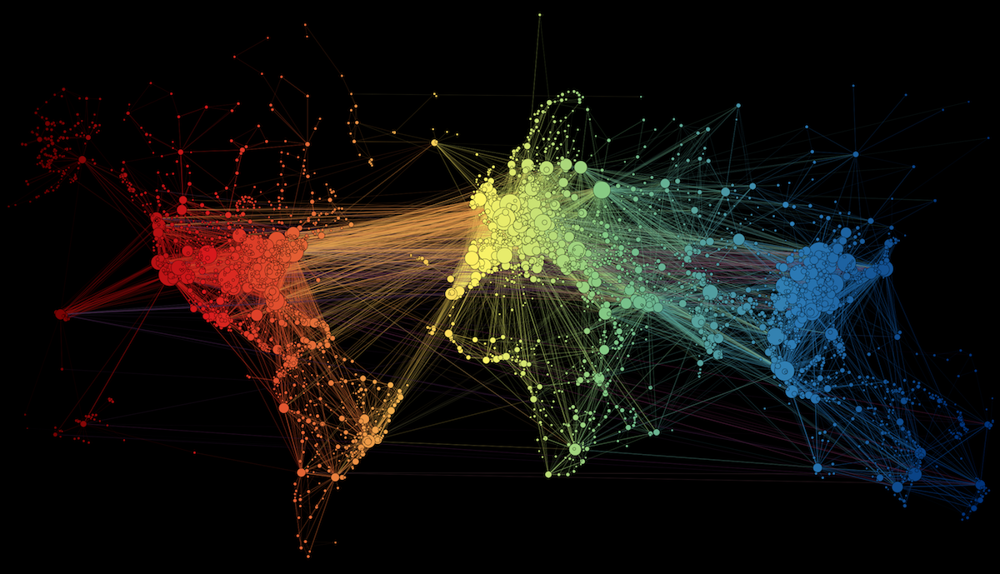
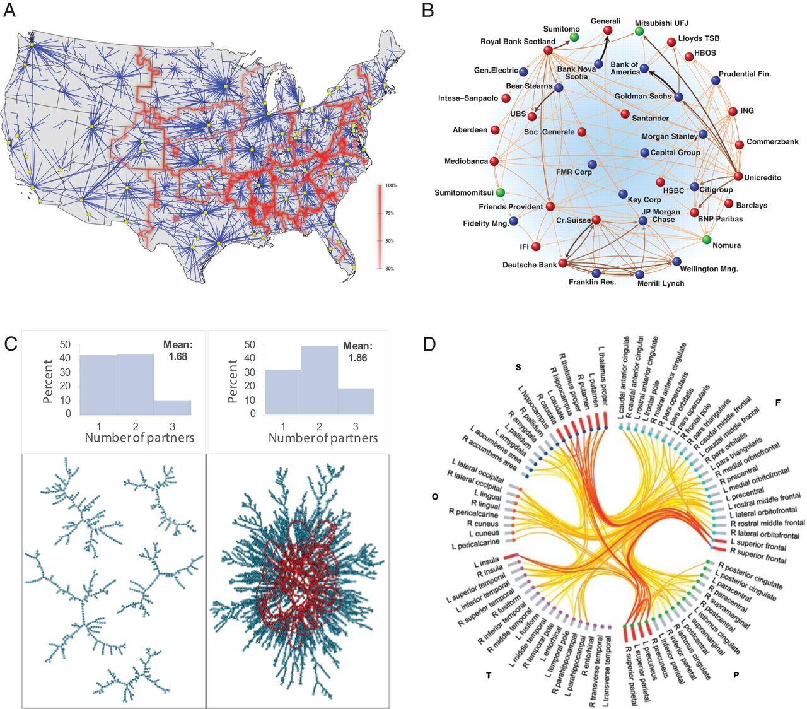
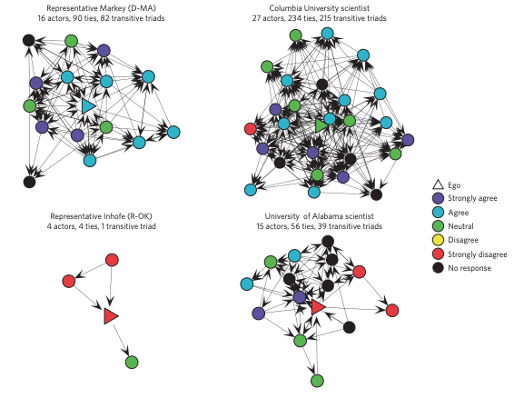
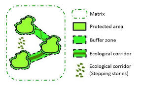

```{r setup, include=FALSE}
knitr::opts_chunk$set(warning = FALSE, message = FALSE, 
                      fig.retina = 3, fig.align = "center")
```


```{r packages-data, include=FALSE}
library(tidyverse)
library(pander)
library(sf)
library(igraph)
library(terra)
```

name: 1
class: center middle main-title section-title-4

# Building Networks from Spatial Data

.class-info[

**Session 9**

.light[HES597: Introduction to Spatial Data in R<br>
Boise State University Human-Environment Systems<br>
Fall 2021]

]

---

# Outline

- Introducing networks

- Applications of networks

- Building networks (in `R`)

- (Some) Network properties of interest

---

# Defining Networks

.pull-left[
- Network theory is a subset of __graph theory__

  - _Graphs_: mathematical structures used to model the relations between objects
  
  - Comprised of _nodes_ (vertices, points) and _edges_ (links)
  
- In network analysis, our _nodes_ and/or _edges_ have __names__ (or attributes)
]

.pull-right[
```{r simpnet, echo=FALSE, fig.height=5, fig.width=5}
g <- graph_from_literal( 1-2-3-1, 4-3-5,
                          3-6 )
plot(g)
```
]
---

## What sorts of things might comprise nodes and edges in your work?
---

# Types of Networks
.pull-left[
- Undirected

```{r undigraph, echo=FALSE}
g <- graph_from_literal( Alice-Bob-Cecil-Alice, Daniel-Cecil-Eugene,
                     Cecil-Gordon )
plot(g)

```
]
.pull-right[
- Directed
```{r digraph, echo=FALSE}
g <- graph_from_literal( Alice+-+Bob+-Cecil+-+Alice, Daniel+-+Cecil-+Eugene,
                     Cecil+-+Gordon )
plot(g)

```
]
---
# Types of Networks
.pull-left[
- Uweighted

```{r unwtgraph, echo=FALSE}
g <- graph_from_literal( Alice-Bob-Cecil-Alice, Daniel-Cecil-Eugene,
                     Cecil-Gordon )

E(g)$weight <- 1
plot(g, edge.label=E(g)$weight)
```
]

.pull-right[
- Weighted

```{r wtgraph, echo=FALSE}
g <- graph_from_literal( Alice-Bob-Cecil-Alice, Daniel-Cecil-Eugene,
                     Cecil-Gordon )

E(g)$weight <- sample(1:10, 6, replace = TRUE)
plot(g, edge.label=E(g)$weight)
```

]
---
class: middle
# Types of Graphs

- Many additional common types of graphs (beyond the scope of this course)

- Connected graphs, bipartite graphs, acyclic graphs are common in our field(s)

- Check out Vicken Hillis' HES 597: Social Network Analysis course for more
---
name: apps
class: center middle main-title section-title-4

# Common of Applications of Networks

---

# Transportation and infrastructure

.pull-left[

<figure>
  
</figure>
.caption[
From [Martin Grandjean](http://www.martingrandjean.ch/connected-world-air-traffic-network/)]
]

.pull-right[

<figure>
  
</figure>
.caption[
Paul Cuffe, [CC BY-SA 4.0](https://creativecommons.org/licenses/by-sa/4.0), via Wikimedia Commons
]
]

---

# Social Sciences

.pull-left[

<figure>
  
</figure>
.captiona[
From Buyalskaya et al. 2021
]

]

.pull-right[

<figure>
  
</figure>
.caption[
From Jasny et al. 2015
]
]

---

# Ecology

.pull-left[
<figure>
  
</figure>
.caption[
Jennifer Dunne, Santa Fe Institute
]
]

.pull-right[
<figure>
  
</figure>
.caption[
Adapted from Palomo et. al 2014
]
]
---
# Constructing networks

## Adjacency matrices

.pull-left[
- unweighted: 1 if 'adjacent' 0 if not
- undirected: matrix is symmetric

```{r adjmat, echo=FALSE, fig.cap="undirected, unweighted"}
mtx <- matrix(rep(0,36), nrow=6)
b <- sample(0:1, 18, replace=TRUE, prob = c(0.7,0.3))
mtx[lower.tri(mtx)] <- b
mtx <- t(mtx)
mtx[lower.tri(mtx)] <- b
rownames(mtx) <- LETTERS[1:6]
colnames(mtx) <- LETTERS[1:6]
print(mtx)
```
]
.pull-right[
- weighted: value reflects the strength of connections
- directed: not all connections are reciprocal
```{r dirmatmat, echo=FALSE}
nzs <- function(x) sort(x [x!=0])
adjm <- matrix(round(runif(36),digits = 2), 6)
adjm[ adjm<0.5 ] <- 0
rownames(adjm) <- LETTERS[1:6]
colnames(adjm) <- LETTERS[1:6]
print(adjm)
```
]
---
# We can use the `igraph` package to convert these to graphs
.pull-left[
```{r adjnetwork, fig.height=5, fig.width=5}
plot(igraph::graph_from_adjacency_matrix(mtx, mode='undirected'))
```
]
.pull-right[
```{r wtdnetwork, fig.height=5, fig.width=5}
g <- igraph::graph_from_adjacency_matrix(adjm, mode='directed', weighted = TRUE)
  
plot(g, edge.label=E(g)$weight)
```
]
---
# Constructing Networks

## Edge lists

- Adjacency matrices become LARGE for relatively simple networks

- For many networks, connections are limited (i.e., matrices are sparse)

- Often easier to provide a list of connections

- Can also provide weights in a dataframe (see the transportation example)
---

# Characterizing networks

- Degree distribution: the number of edges between each node and other nodes
- Clustering coefficient: provides an indication of local spatial structure
- Motifs: repeating subgraph shapes in a netwrok
- Connectivity: minimum # of elements to remove to generate isolated subraphs
- Centrality: characterize the network position of nodes or edges
- LOTS of others

---

name: spatial
class: center middle main-title section-title-4

# Spatial Networks
---

# Spatial Networks

- Space is often _implicit_ in network analyses

- Probability of finding a link decreases with distance

- Different edge weights may alter these probabilities

- Generally planar

---

# Generating Spatial Networks in R

## Defining adjacency
.pull-left[
```{r distmtx}
p = st_sfc(st_point(c(0,2)), st_point(c(0,1)), st_point(c(0,4)), st_point(c(1,2)), st_point(c(3,1)), st_point(c(2,4)))
round(st_distance(p), digits = 2)
```
]

.pull-right[
```{r pdist, echo=FALSE, fig.height=5, fig.width=5}
plot(igraph::graph_from_adjacency_matrix(round(st_distance(p), digits = 2), mode='undirected'))
```
]
---
# Generating Spatial Networks in R

## Defining adjacency
 - With a distance threshold
 
.pull-left[
```{r trshmtx}
adjm <-  ifelse(st_distance(p) <1.5, 1,0)  
adjm
```
]
.pull-right[
```{r netplot, echo=FALSE, fig.height=5, fig.width=5}
plot(igraph::graph_from_adjacency_matrix(adjm, mode='undirected'))
```
]
---

# Generating Spatial Networks in R
- for rasters
- `directions` define window for connected cells
- important for connectivity analyses

```{r rastadj}
r <- rast(nrows=10, ncols=10)
values(r) <- round(runif(ncell(r)) * 5)
a <- adjacent(r, 1:ncell(r), directions="queen") 

```