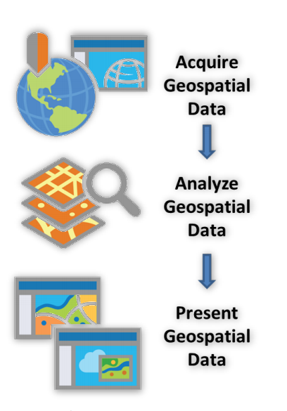
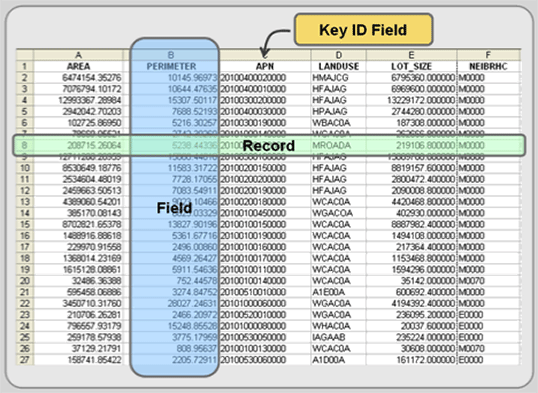

```{r setup, include=FALSE}
knitr::opts_chunk$set(warning = FALSE, message = FALSE, 
                      fig.retina = 3, fig.align = "center")
```


```{r packages-data, include=FALSE}
library(tidyverse)
library(pander)
library(sf)
library(igraph)
library(terra)
library(spData)
```
name: 1
class: center middle main-title section-title-4

# Building spatial databases based on attributes

.class-info[

**Session 11**

.light[HES597: Introduction to Spatial Data in R<br>
Boise State University Human-Environment Systems<br>
Fall 2021]

]

---
# Outline for today

- What do we mean by spatial _analysis_?

- Planning an analysis

- Databases and attributes

- Building a database for an analysis (part 1)

---
class: center middle
# What is spatial analysis?

---
# What is spatial analysis?
.pull-left[

- The process of turning maps into information


- Any- or everything we do with GIS

- ESRI Dictionary: "The process of examining the locations, attributes, and relationships of features in spatial data through overlay and other analytical techniques in order to address a question or gain useful knowledge. Spatial analysis extracts or creates new information from spatial data".

- The use of computational and statistical algorithms to understand the relations between things that co-occur in space.

]
.pull-right[
<figure>
  
</figure>
.caption[
John Snow's cholera outbreak map
]
]
---
class: center middle
# Common goals for spatial analysis
---
# Common goals for spatial analysis
.pull-left[
<figure>
  
</figure>
.caption[
courtesy of [NatureServe](https://www.natureserve.org/products/species-distribution-modeling)
]
]
.pull-right[
- Determine (statistical) relations

- Describe and visualize locations or events

- Quantify patterns

- Characterize 'suitability'
]
---
# Common pitfalls of spatial analysis

- __Locational Fallacy:__ Error due to the spatial characterization chosen for elements of study


- __Atomic Fallacy:__ Applying conclusions from individuals to entire spatial units


- __Ecological Fallacy:__ Applying conclusions from aggregated information to individuals


> Spatial analysis is an inherently complex endeavor and one that is advancing rapidly. So-called "best practices" for addressing many of these issues are still being developed and debated. This doesn't mean you shouldn't do spatial analysis, but you should keep these things in mind as you design, implement, and interpret your analyses

---
name: workflows
class: center middle main-title section-title-4

# Workflows for spatial analysis
---
# Workflows for spatial analysis

.pull-left[
- Acquisition (not really a focus, but see [Resources](content/resource/))

- Geoprocessing 

- Analysis 

- Visualization 
]

.pull-right[
<figure>
  
</figure>
.caption[
courtesy of [University of Illinois](https://guides.library.illinois.edu/c.php?g=348425&p=5443868)
]
]
---
# Geoprocessing

__manipulation of data for subsequent use__

- Data cleaning and transformation

- Combination of multiple datasets

- Selection and subsetting

- Overlays (next week)

- Raster processing (two weeks)
---
name: database
class: center middle main-title section-title-4

# Databases and attributes
---
# Databases and attributes

.pull-left[
<figure>
  
</figure>
.caption[
courtesy of [Giscommons](https://giscommons.org/data-tables-and-data-preprocessing/)
]
]
.pull-right[
- Previous focus has been largely on _location_

- Geographic data often also includes non-spatial data

- Attributes: Non-spatial information that further describes a spatial feature

- Typically stored in tables where each row represents a spatial feature
  - Wide vs. long format
]
---
name: apps
class: center middle main-title section-title-4

# Common attribute operations
---
# Common attribute operations

- `sf` is a part of the `tidyverse`

- Allows use of `dplyr` data manipulation verbs 

- Also allows `%>%` to chain together multiple steps

- geometries are "sticky"
---
# Subsetting fields (`select`)
.pull-left[
```{r wrld1}
head(world)[,1:3] %>% st_drop_geometry()
colnames(world)
```
]

.pull-right[
```{r wrld2}
world %>%
  dplyr::select(name_long, continent) %>%
  st_drop_geometry() %>% 
  head(.) 
```
]

---
# Subsetting features (`filter`)
.pull-left[
```{r wrld3}
head(world)[,1:3] %>% st_drop_geometry()

```
]

.pull-right[
```{r wrldfiltr}
world %>%
  filter(continent == "Asia") %>% 
    dplyr::select(name_long, continent) %>%
  st_drop_geometry() %>% 
  head(.)
```
]
---
# Creating new fields (`mutate`)
.pull-left[
```{r wrld4}
head(world)[,1:3] %>% st_drop_geometry()

```
]

.pull-right[
```{r wrldmutate}
world %>%
  filter(continent == "Asia") %>% 
    dplyr::select(name_long, continent, pop, area_km2) %>%
  mutate(., dens = pop/area_km2) %>%
  st_drop_geometry() %>% 
  head(.)
```
]
---
# Aggregating data
.pull-left[
```{r wrld5}
head(world)[,1:3] %>% st_drop_geometry()

```
]

.pull-right[
```{r wrldagg}
world %>%
  st_drop_geometry(.) %>% 
  group_by(continent) %>%
  summarize(pop = sum(pop, na.rm = TRUE))
```
]

---
name: joins
class: center middle main-title section-title-4

# Joining (a)spatial data

---
# Joining (a)spatial data
.pull-left[

- Requires a "key" field 

- Multiple outcomes possible

- Think about your final data form
]
.pull-right[
<figure>
  
</figure>
]
---
# Left Join

.pull-left[
- Useful for adding other attributes not in your spatial data

- Returns all of the records in `x` attributed with `y`

- Pay attention to the number of rows!
]
.pull-right[
```{r cofhead}
head(coffee_data)
```
]
---
# Left Join

.pull-left[
```{r cofjn}
world_coffee = left_join(world, coffee_data)
nrow(world_coffee)
```
]
.pull-right[
```{r cofplot}
plot(world_coffee["coffee_production_2017"])
```

---
# Inner Join
.pull-left[
- Useful for subsetting to "complete" records

- Returns all of the records in `x` with matching `y`

- Pay attention to the number of rows!
]

---
# Inner Join

.pull-left[
```{r cofinjn}
world_coffee_inner = inner_join(world, coffee_data)
nrow(world_coffee_inner)
```
]
.pull-right[
```{r cofdif}
setdiff(coffee_data$name_long, world$name_long)
```
