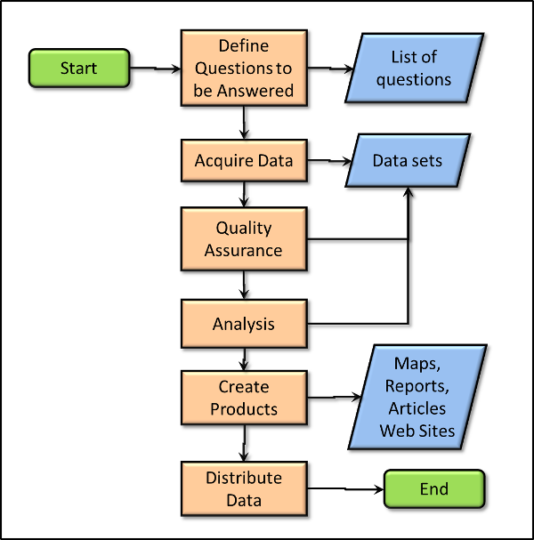

```{r setup, include=FALSE}
knitr::opts_chunk$set(warning = FALSE, message = FALSE, 
                      fig.retina = 3, fig.align = "center")
```


```{r packages-data, include=FALSE}
library(tidyverse)
library(pander)
library(sf)
library(igraph)
library(terra)
library(spData)
library(units)
```
name: 1
class: center middle main-title section-title-4

# Building spatial databases using locations

.class-info[

**Session 13**

.light[HES597: Introduction to Spatial Data in R<br>
Boise State University Human-Environment Systems<br>
Fall 2021]

]

---

# Outline for today

- Update on assignments and mini-projects

- Refresher: Building a spatial analysis workflow

- Building a database for an analysis (part 2) based on location

---

# Update on assignments

- Looking good for the most part
  - _Please knit your final documents_

- Class projects
  - Full description of each will be on class webpage by 8 Oct 2012
  - Updated due dates
    - Mini-project 1: October 25
    - Mini-project 2: November 12
  - Schedule updated by end of today
  
---
class: center middle
# Revisiting spatial analysis

---
name: workflows
class: center middle main-title section-title-4

# Workflows for spatial analysis
---
# Workflows for spatial analysis

.pull-left[
<figure>
  
</figure>
.caption[
courtesy of [Humboldt State University](http://gsp.humboldt.edu/olm/Lessons/GIS/06%20Vector%20Analysis%20Attributes/00_SpatialAnalysis.html)
  ]
]

.pull-right[

- Align processing with objectives

- Imagining the visualizations and analysis clarifies file formats and variables

- Helps build reproducibility 
]

---

# Databases and attributes

.pull-left[
<figure>
  
</figure>
.caption[
courtesy of [Giscommons](https://giscommons.org/data-tables-and-data-preprocessing/)
]
]
.pull-right[

- Attributes: Information that further describes a spatial feature

- Attributes &rightarrow; predictors for analysis 

- Last week focus on thematic relations between datasets
  - Shared 'keys' help define linkages between objects

- Sometimes we are interested in attributes that describe location (overlaps, contains, distance)

- Sometimes we want to join based on location rather than thematic connections
  - __Must have the same CRS__
]

--- 

# Calculating attributes based on geometry and location vector data

- Attributes like area and length can be useful for a number of analyses
  - Estimates of 'effort' in sampling designs
  - Offsets for modeling rates (e.g., Poisson regression)
  
- Need to assign the result of the function to a column in data frame (e.g., `$`, `mutate`, and `summarize`)

- Often useful to test before assigning

---
# Estimating area

- `sf` bases area (and length) calculations on the map units of the CRS

- the `units` library allows conversion into a variety of units

- can use `st_length` in the same way

.pull-left[
```{r area}
nz.sf <- nz %>% 
  mutate(area = set_units(st_area(nz), km^2))
head(nz.sf$area, 3)
```
]

.pull-right[
```{r area2}
nz.sf$areaagain <- set_units(st_area(nz), km^2)
head(nz.sf$areaagain, 3)
```
]

---
# Extending area

- Sometimes we want to estimate the area of overlap between two vectors
  - How much of home range _a_ occurs on soil type _b_
  - How much of each Census tract is contained with a service provision area?
- `st_intersection`, `st_union`, and `st_difference` return new geometries whose area we can estimate
  
.pull-left[
```{r overlap, echo=FALSE, message=FALSE, warning=FALSE, fig.pos="t"}
transmitters <-
  data.frame(
    ID = 1:2,
    longitude = c(-80.631974, -77.808488),
    latitude = c(35.838583, 35.526252),
    radius = c(50, 100))

### Turn transmitters df into an sf object
tr_wgs <- 
  st_as_sf(transmitters, 
           coords = c("longitude", "latitude"), 
           crs = 4326, 
           dim = "XY")

### Set units (a projection that preserves area in NC)
tr_wgs <- 
  st_transform(tr_wgs, 
               "+proj=aea +lat_1=29.5 +lat_2=45.5 +lat_0=37.5 +lon_0=-96 +x_0=0 +y_0=0 +ellps=GRS80 +datum=NAD27 +units=km")

### Create a buffer (not sure of the original km measurements, so right now it is just making a 100km buffer)
tr_buff <- 
  st_buffer(tr_wgs, c(transmitters$radius))

### Read North Carolina (and coerce to be same projection as tr_buff)
nc <-
  st_read(system.file("shape/nc.shp", package="sf"), quiet = TRUE) %>%
  st_transform(., "+proj=aea +lat_1=29.5 +lat_2=45.5 +lat_0=37.5 +lon_0=-96 +x_0=0 +y_0=0 +ellps=GRS80 +datum=NAD27 +units=km")

### Plot
ggplot() +
  geom_sf(data = nc) +
  geom_sf(data = tr_buff, color="red")

```
]  

.pull-right[
```{r ovrpct}
intersect_pct <- st_intersection(nc, tr_buff) %>% 
   mutate(intersect_area = st_area(.)) %>%   # create new column with shape area
   dplyr::select(NAME, intersect_area) %>%   # only select columns needed to merge
   st_drop_geometry()

nc <- mutate(nc, county_area = st_area(nc))

# Merge by county name
nc <- merge(nc, intersect_pct, by = "NAME", all.x = TRUE)

# Calculate coverage
nc <- nc %>% 
   mutate(coverage = as.numeric(intersect_area/county_area))
```
]

---
# Extending area

```{r plotover}
ggplot() +
  geom_sf(data = nc, aes(fill=coverage)) +
  geom_sf(data = tr_buff, fill=NA, color="red")
```
---
# Estimating distance

- As a covariate

- For use in covariance matrices

- As a means of assigning connections in networks

---

# Estimating distance
 -  `grepl` here is returning a `logical` (TRUE/FALSE) result for items in `nz$Name` that match (partially) "Canter" or (`|`) "Otag"
 
 -  `nz_height[canterbury, ]` is subsetting the `nz_height` dataset based on the `canterbury` polygon
 
 - `nz_height[1]` occurs outside Otago (in red) while the remaining are _in_ Otago (so distance is 0)
 
.pull-left[
```{r dist}
canterbury = nz %>% filter(Name == "Canterbury")
canterbury_height = nz_height[canterbury, ]
co = filter(nz, grepl("Canter|Otag", Name))
st_distance(nz_height[1:3, ], co)
```
]
.pull-right[
```{r distplot, fig.height=4.5, fig.width=4.5}
plot(st_geometry(co)[2], col="red") 
plot(st_geometry(nz_height)[1], col="blue", add=TRUE)
plot(st_geometry(nz_height)[2:3], add = TRUE, col="black")
```
]

---
# Topological Subsetting

- Topological relations describe the spatial relationships between objects
- We can use the overlap (or not) of vector data to subset the data based on topology
- Easiest way is to use `[` notation, but also most restrictive

.pull-left[
```{r sub}
canterbury_height = nz_height[canterbury, ]
```
]
.pull-right[
```{r plotsub, fig.height=4, fig.width=5}
plot(st_geometry(canterbury))
plot(st_geometry(nz_height), col="red", add=TRUE)
plot(st_geometry(canterbury_height), col="blue", add=TRUE)
```
]
---
# Topological Subsetting
- Lots of verbs in `sf` for doing this (e.g., `st_intersects`, `st_contains`, `st_touches`)
- see `?geos_binary_pred` for a full list
- The `sparse` option controls how the results are returned
- We can then find out if one or more elements satisfies the criteria

__Using `sparse=TRUE`__
```{r top}
st_intersects(nz_height, co, sparse = TRUE)[1:3] 

lengths(st_intersects(nz_height, co, sparse = TRUE))[1:3] > 0
```
---
# Topological Subsetting

- The `sparse` option controls how the results are returned
- We can then find out if one or more elements satisfies the criteria

__Using `sparse=FALSE`__
```{r top2}
st_intersects(nz_height, co, sparse = FALSE)[1:3] 

apply(st_intersects(nz_height, co, sparse = TRUE), 1,any)[1:3]
```

---
# Topological Subsetting

.pull-left[
```{r subset}
canterbury_height3 = nz_height %>%
  filter(st_intersects(x = ., y = canterbury, sparse = FALSE))
```
]
.pull-right[
```{r subsetplot, echo=FALSE}

plot(st_geometry(nz))
plot(st_geometry(canterbury_height3), add=TRUE)
```
]

---
# Spatial Joins

- `sf` package provides `st_join` for vectors

- Allows joins based on the predicates (`st_intersects`, `st_touches`, `st_within_distance`, etc.)

- Default is a left join
