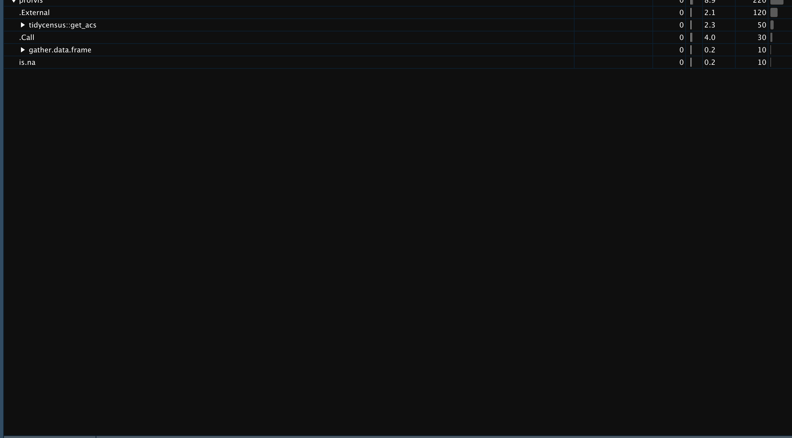
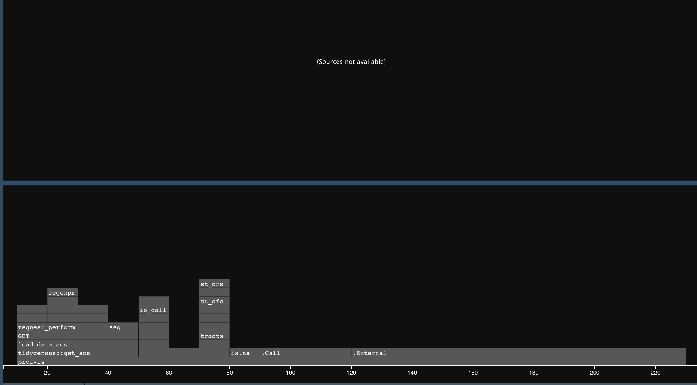

```{r setup, include=FALSE}
knitr::opts_chunk$set(warning = FALSE, message = FALSE, 
                      fig.retina = 3, fig.align = "center")

```


```{r packages-data, include=FALSE}
library(tidyverse)
library(pander)
library(sf)
library(igraph)
library(terra)
library(spData)
library(units)
library(purrr)
library(parallel)
library(furrr)
library(sp)
library(profvis)
mos <- terra::rast('/Users/matthewwilliamson/Downloads/session04/idval.tif')
#mos <- terra::rast('/Users/mattwilliamson/Google Drive/My Drive/TEACHING/Intro_Spatial_Data_R/Data/session04/idval.tif')
counties.id <- tigris::counties("id") %>% as(., 'SpatVector')
counties.p <- terra::project(counties.id, mos)
elev <- geodata::elevation_30s(country="USA", path=tempdir())
elev.crop <- terra::crop(elev, ext(project(mos, terra::crs(elev))))
elev.proj <- project(elev.crop, mos)
elev.res <- resample(elev.proj, mos)
id.income <- tidycensus:: get_acs(geography = "tract", 
              variables = c(medianicome = "B19013_001"),
              state = "ID", 
              year = 2018,
              key = "90b94953d2f24e81e890229e0128174f5ba80d3f",
              geometry = TRUE) %>% 
                st_transform(., crs(counties.p))
```

name: 1
class: center middle main-title section-title-4

# Workflows for combining raster and vector data

.class-info[

**Session 15**

.light[HES597: Introduction to Spatial Data in R<br>
Boise State University Human-Environment Systems<br>
Fall 2021]

]

---
# Outline for today
 - Revisiting Raster operations
 
 - Generating zonal statistics
 
 - Generalizing extractions
 
 - Scaling to larger problems
---
name: ops
class: center middle main-title section-title-4

# Revisiting raster operations
---
# Revisiting raster operations

```{r, echo=FALSE, warning=FALSE}
opar <- par()
par(mfrow = c(1, 2))
plot(mos, main = "Raster of ID Land Value")
plot(elev.res, main = "Raster of ID elevation")
par(opar)

```
---
# Raster Math

.pull-left[
* Simple calculations
```{r rstmth}
development.difficulty <- exp(mos) + elev.res/4
plot(log(development.difficulty))
```
]

.pull-right[
* Custom Functions
```{r rstfun}
normalize<- function(rster) (rster - min(rster, na.rm=TRUE))/(max(rster, na.rm=TRUE) - min(rster, na.rm=TRUE))
elev.nrm <- app(elev.res, normalize)

plot(elev.nrm)
```
]
--- 
# Raster math with polygons

* Need to convert field to raster first
* `terra::rasterize` and `fasterize::fasterize` do this for `SpatVector` and `sf` objects

```{r rstrze}
med.inc.rstr <- terra::rasterize(x = as(id.income, "SpatVector"), y = mos, field="estimate")
```
---
# Raster math with polygons

.pull-left[
```{r vplot, echo=FALSE}
plot(id.income["estimate"], key.pos = 1, axes = TRUE, key.width = lcm(1.3), key.length = 1.0)
```
]
.pull-right[
```{r rplot, echo=FALSE}
plot(med.inc.rstr)
```
]
---
# Raster math with polygons
```{r vmath,}
income.ratio <- med.inc.rstr/mos
plot(income.ratio, main="Ratio of median income to housing cost")
```

---
name: zonal
class: center middle main-title section-title-4

# Zonal statistics
---
# Zonal statistics

* Allow extraction from one raster to a categorical raster
* Need the zones to be rasterized

```{r zones}
cty.rster <- terra::rasterize(counties.p, y=mos, field="GEOID")
zones <- terra::zonal(mos, cty.rster, "mean", na.rm=TRUE)
head(zones)
```
---
name: extract
class: center middle main-title section-title-4
# Extractions
---
# Extractions
* Zonal stats are fast, but limited
* `terra::extract` more generalizable
* converts vector to raster i the background

```{r ext}
extraction <- terra::extract(mos, counties.p, mean, na.rm=TRUE)
head(extraction)
```

---
name: tiles
class: center middle main-title section-title-4

# Scaling to larger extents
---

## Revisiting the `apply` family
.pull-left[
- A flexible group of functions that replace `for` or `while` loops

- Translates loops in C++ code, often provides speed-up

- Which member of the 'family' depends on input data and output desired

- Can be tricky to get desired behavior (*algorithmic efficiency* vs. *programmer efficiency*)
]

.pull-right[
- `apply` requires three arguments: an `array`, the `margin`, and the `function` you want to execute

- `arrays` are R data objects that contain 1, 2, or more dimensions

- `margins` identify which parts of the array to apply the `function` over (1 = rows, 2 = columns, 1:2 = all cells in a matrix) 
]
---

## A reminder
.pull-left[
```{r applyintro}
#create data
test.matrix <- matrix(rnorm(50), 10, 5)
dim(test.matrix)
# generate column means
col.mean <- apply(X=test.matrix, MARGIN = 2, mean)
str(col.mean)
```
]
.pull-right[
```{r applyintro2}
#generate row sums
row.sum <- apply(X=test.matrix, MARGIN = 1, sum)
str(row.sum)
#exponentiate each cell of the data
exp.all <- apply(X=test.matrix, MARGIN = 1:2, exp)
str(exp.all)
```
]
---
## The `map` function from `purrr` and the `tidyverse` 

- Acts like `apply` but can be more flexible and interpretable
- Has a similar 'family' of functions designed for different situations
- Here we are downloading files from Google Drive

```{r mapapp, eval=FALSE}
folder_url <- "https://drive.google.com/open?id=1xSsKYpB2o9SEIo6pZDFWYqVthb162_Zo"
folder <- drive_get(as_id(folder_url))
tif_files <- drive_ls(folder)

lapply(tif_files$id, function(x) drive_download(as_id(x), overwrite = TRUE))
map(tif_files$id, ~drive_download(as_id(.x), overwrite = TRUE))
```

- the key is that we are still sending the first argument (`tif_files$id`) to a function!

---
## Parallelism and spatial computing

- `lapply` and `map` work serially

- Parallelization is useful when pieces of a problem are independent 

- "Embarassingly parallel" refers to problems that can be broken down into small chunks and run simultaneously using your computer's different processors

- `mclapply` and `future_map` allow this in a general way; `raster` and `terra` allow some implicit parallelism

---
## What is efficiency?
 
 - Algorithmic efficiency
 
 - Programmer efficiency

  - Goal: _Fast enough_  computationally, _fast as possible_ for the programmer

---

## Benchmarking vs. Profiling

- **Benchmarking**: tests the performance of specific operations repeatedly

- **Profiling**: evaluates many lines of code to find "bottlenecks"

---
## Using `mclapply` to extract data

- relies on "forking" 

- Can be slower than standard processing if the dataset being copied to the child process is large

```{r mcltest}

counties.ext <- mclapply(seq_along(counties.p), function(x){
  cty.ext = counties.p[x]
  terra::extract(mos, cty.ext)
}, mc.cores = 4)

counties.sf <- as(counties.p, "Spatial") %>% 
  as(., "sf")

counties.df <- map(seq_along(counties.p), function(x){
   data.frame(GEOID = st_drop_geometry(counties.sf[x, "GEOID"]),
              mn = mean(counties.ext[[x]][[2]], na.rm=TRUE),
              sd = sd(counties.ext[[x]][[2]], na.rm = TRUE),
              min = min(counties.ext[[x]][[2]], na.rm = TRUE),
              max = max(counties.ext[[x]][[2]], na.rm = TRUE))
  }
) %>% do.call(rbind, .)
  
```
---
## Evaluating `mclapply` to extract data
.pull-left[
```{r timing1}
s.mclapply <- system.time(mclapply(seq_along(counties.p), function(x){
  cty.ext = counties.p[x]
  terra::extract(mos, cty.ext)
}, mc.cores = 4))
s.mclapply
```
]
.pull-right[
```{r timing2}
s.lapply <- system.time(lapply(seq_along(counties.p), function(x){
  cty.ext = counties.p[x]
  terra::extract(mos, cty.ext)
}))
s.lapply
```
]

---
## Translating to the `map_` family
- relies on the `furrr` package
```{r futureexp, warning=FALSE, message=FALSE}
library(furrr)
mos.rast <- raster::raster(mos)
future::plan(multisession)
counties.ext <- future_map(seq_along(counties.p), function(x){
  library(sf) #each operation in a new session
  cty.ext = counties.sf[x,] %>% as(., "Spatial")
  raster::extract(mos.rast, cty.ext)
  })
```
---
## Timing `future_`
.pull-left[
```{r timing3}
s.future <- system.time(future_map(seq_along(counties.p), function(x){
  library(sf) #each operation in a new session
  cty.ext = counties.sf[x,] %>% as(., "Spatial")
  raster::extract(mos.rast, cty.ext)
}))

s.future

```
]
.pull-right[
```{r timing4}
s.map <- system.time(map(seq_along(counties.p), function(x){
  library(sf) #each operation in a new session
  cty.ext = counties.sf[x,] %>% as(., "Spatial")
  raster::extract(mos.rast, cty.ext)
}))

s.map
```
]

---
## Benchmarking with `microbenchmark`
 
 - `system.time` provides a sample
 
 - `microbenchmark` generates multiple (default is 100) samples
  -   More robust to vagaries of background computer noies
---
## Profiling

- Designed to locate bottle necks in large chunks of code

- Pinpoint which parts of your script or function takes the longes to run

- **Important:** _working code first, profile code second_ 
---
## Profile example

```{r rprof, eval=FALSE}
rasterize.prof <- profvis(expr = {
  #load packages
  library(terra)
  library(tidycensus)
  library(tidyverse)
  #download data and convert to Spatial
  id.income <- tidycensus:: get_acs(geography = "tract", 
              variables = c(medincome = "B19013_001"),
              state = "ID", 
              year = 2018,
              key = "90b94953d2f24e81e890229e0128174f5ba80d3f",
              geometry = TRUE) %>% 
                st_transform(., crs(counties.p)) %>% 
    as(., "SpatVector")
  
  #process into raster
  income.tct.rst <- terra::rasterize(x=id.income,
                                           y=elev.res,
                                           field = "estimate")
}, interval = 0.01, prof_output = 'fstr-prof' )
```
---
## Profile Example
.pull-left[
<figure>
  
  <figcaption>Profile results</figcaption>
</figure>
]
.pull-righ[
<figure>
  
  <figcaption>Profile results</figcaption>
</figure>
]
---
## Fixing bottlenecks

1. Look for existing solutions (`fasterize`)
2. Do less work
3. Parallelize (next week)
4. Avoid copies

_Remember programmer efficiency!_
---

## Additional directions

- socket clusters (`makeCluster`, `parLapply`) - Useful when data needs to be passed back and forth among jobs (see [R Programming for Data Science](https://bookdown.org/rdpeng/rprogdatascience/parallel-computation.html))

- lots of variations on `map_` (see the [purrr documentation](https://purrr.tidyverse.org/reference/map.html)) and `apply`

- The `foreach` package adds additional functionalilty (see [this blog](https://www.r-bloggers.com/how-to-go-parallel-in-r-basics-tips/) for more info on parallel processing)
