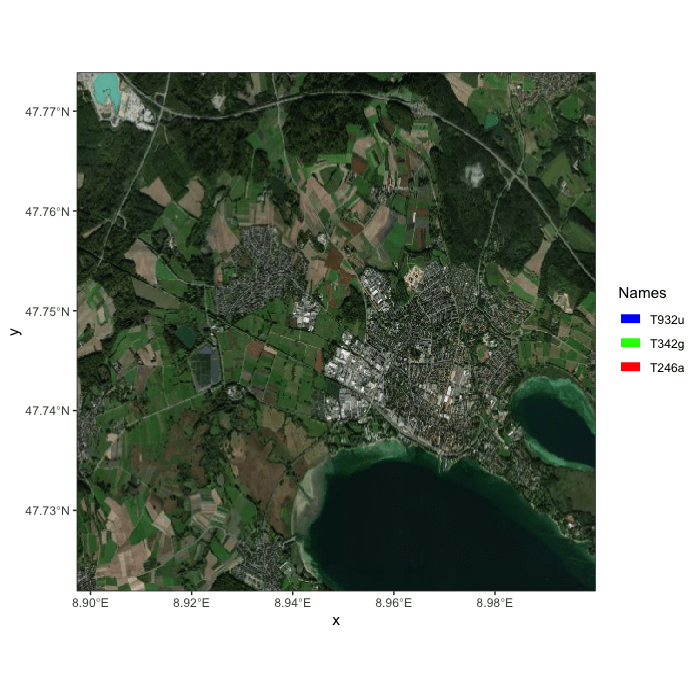

```{r setup, include=FALSE}
knitr::opts_chunk$set(warning = FALSE, message = FALSE, 
                      fig.retina = 3, fig.align = "center")

```


```{r packages-data, include=FALSE}
library(pander)
library(tidycensus)
library(sf)
library(tidyverse)
library(socviz)
library(maps)
library(plotly)
library(tmap)
library(spData)

```
name: 1
class: center middle main-title section-title-4

# Interactive webmapping and visualization with R

.class-info[

**Session 19**

.light[HES597: Introduction to Spatial Data in R<br>
Boise State University Human-Environment Systems<br>
Fall 2021]

]

---
# 3 Categories of data visualization
.pull-left[

- Static

- Interactive

- Dynamic

]
.pull-right[

]
---
name: motivations
class: center middle main-title section-title-4

# Motivations 

---
# Dealing with complex datasets

.pull-left[
<figure>
  
</figure>
]
.pull-right[

- Identifying structure that might otherwise be hidden

- Diagnosing models and interpreting results

- Aiding the sense-making process

]
---
# Clarity in presentation

- Zooming allows the user to determine scale of presentation

- Hovering allows more information to be displayed 'on-demand'

- Subsetting facilitates ease of interpretation

---
# Clarity in presentation

.pull-left[
```{r gplot, echo=FALSE, message=FALSE, warning=FALSE}
g <- ggplot(txhousing, aes(x = date, y = sales, group = city)) +
  geom_line(alpha = 0.4) +
  ggtitle("Texas Housing Prices")
g
```
]
.pull-right[
```{r pltly, echo=FALSE}
g <- txhousing %>% 
  # group by city
  group_by(city) %>%
  # initiate a plotly object with date on x and median on y
  plot_ly(x = ~date, y = ~median) %>%
  # add a line plot for all texan cities
  add_lines(name = "Texan Cities", hoverinfo = "none", 
            type = "scatter", mode = "lines", 
            line = list(color = 'rgba(192,192,192,0.4)')) %>%
  # plot separate lines for Dallas and Houston
  add_lines(name = ~city, 
            data = filter(txhousing, 
                          city %in% c("Dallas", "Houston")),
            hoverinfo = ~city,
            line = list(color = c("red", "blue")),
            color = ~city)
g
```
]
---
# Telling a story

- Order of information can evoke emotional connections

- That reaction helps make your analysis memorable

- [The Shape of Stories](https://youtu.be/oP3c1h8v2ZQ?t=21)

- More on this next week
---
name: ucd
class: center middle main-title section-title-4

# Designing for the User

---
# Who is your audience?

- Your advisor and colleagues?

- An external collaborator?

- The general public?
  - User archetypes
  
---
# Iteration

.pull-left[
<figure>
  
  <figcaption>From Usability.gov</figcaption>
</figure>
]
.pull-right[
- Feedback is critical

- Ideation: What _specifically_ does the user need?

- Meaning: Are the data clearly defined and explained? Are the conclusions obvious?

- Function: Given the usecases, will the application (visualization) actually perform?
]

---
name: survey
class: center middle main-title section-title-4

# Building interactive visualizations in R

---
# A note about APIs

- API: Application Programming Interface

- A software intermediary that allows two applications to "communicate"

- Lots of `R` packages rely on APIs to access data on the web (e.g.,`tidycensus`)

- Facilitates reproducibility and powerful web applications built on `R` analyses

- May require "keys" and addtional parsing (Mapbox and Google)

---

# Interactive maps with `tmap`

- Easy extension of your existing `tmap` skills
```{r tmim, eval=FALSE}
map_nz1 =  tm_shape(nz) + tm_polygons()
tmap_mode("view")
map_nz1
```

Class Demo
---

# Interactive maps with `mapview`

Class demo


---
# Other options

- `leaflet`

- `ggmap`

- `mapsapi`

---
# Animated maps with `tmap` and `gganimate`
.pull-left[
```{r ggani, eval=FALSE}
urb_anim = tm_shape(world) + tm_polygons() + 
  tm_shape(urban_agglomerations) + tm_dots(size = "population_millions") +
  tm_facets(along = "year", free.coords = FALSE)
tmap_animation(urb_anim, filename = "urb_anim.gif", delay = 25)
```
]
.pull-right[

]
---
# Coming soon

- Telling stories with `plotly` and `flexdashboards`