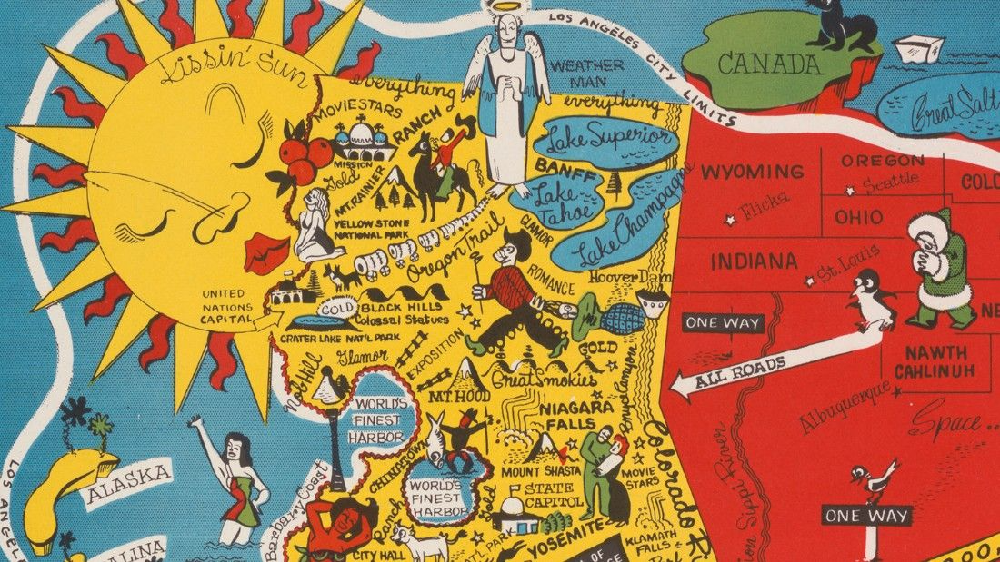

```{r setup, include=FALSE}
knitr::opts_chunk$set(warning = FALSE, message = FALSE, 
                      fig.retina = 3, fig.align = "center")

```


```{r packages-data, include=FALSE}
library(pander)
library(tidycensus)
library(sf)
library(tidyverse)
library(socviz)
library(maps)
library(plotly)
library(tmap)
library(spData)

```
name: 1
class: center middle main-title section-title-4

# Interactive webmapping and visualization with R

.class-info[

**Session 21**

.light[HES597: Introduction to Spatial Data in R<br>
Boise State University Human-Environment Systems<br>
Fall 2021]

]
---
# Plan for today

*   Revisiting story structures

*   Telling stories with data

*   `flexdashboards` and telling stories with `R`

*   `shiny` and increasing the power of your stories
---
name: arcs
class: center middle main-title section-title-4

# Structuring stories
---
class: center middle
# What is a story?

---
# What is a story?

.pull-left[

- Observations, events, facts

- Told in order to elicit an emotional response

- Preempt others making up __your__ story

]

.pull-right[
<figure>
  
</figure>
]
---
# Common story forms

- Opening &rightarrow; Challenge &rightarrow; Action &rightarrow; Resolution

> "Let me tell you a story about the theoretical physicist Stephen Hawking. He was diagnosed with motor neuron disease at age 21—one year into his PhD—and was given two years to live. Hawking did not accept this predicament and started pouring all his energy into doing science. Hawking ended up living to be 76, became one of the most influential physicists of his time, and did all of his seminal work while being severely disabled."
`r tufte::quote_footer('--- Claus Wilke')`

---
# Common story forms

- Lead &rightarrow; Development &rightarrow; Resolution 

> "The influential physicist Stephen Hawking, who revolutionized our understanding of black holes and of cosmology, outlived his doctors’ prognosis by 53 years and did all of his most influential work while being severely disabled..."
`r tufte::quote_footer('--- Claus Wilke')`

---
# Common story forms

- Action &rightarrow; Background &rightarrow; Development &rightarrow; Climax &rightarrow; Ending

> "The young Stephen Hawking, facing a debilitating disability and the prospect of an early death, decided to pour all his efforts into his science, determined to make his mark while he still could..."
`r tufte::quote_footer('--- Claus Wilke')`

---
class: center middle
# Your Turn!!
---
# Telling stories with maps

.pull-left[
<figure>
  
</figure>
]

.pull-right[

- Maps organize a lot of information in a coherent way

- They invite critique and inspection

- They are also aesthetic objects that can engage broader audiences
]
---

# The Storymap

- [Landback Movement](https://storymaps.arcgis.com/stories/bc0fe7486ae3427babe3bed836b4940f)

- [Owyhee Wonders](https://www.owyheewonders.org/?fbclid=IwAR0rpB9IDsM8DJx8GbJb4Xaqhq7szf8VMpf80olkSryb__JKNLeuE1hxFo4#hero)

- [Bison on the Plains](https://storymaps.arcgis.com/stories/135ade9a64a243eaa8e46471432eba25)

---
name: flex
class: center middle main-title section-title-4

# Storyboards in `R`
---
# Telling stories with `flexdashboards`

.pull-left[
- __Dashboard__: a visual display of interrelated data

- `flexdashboards` are an `Rmarkdown`-powered way to build dashboards

- Integrates with `plotly`, `leaflet` and other `htmlwidgets`

- [Examples](https://pkgs.rstudio.com/flexdashboard/articles/examples.html)
]

.pull-right[
<figure>
  
</figure>
]
---
# Telling stories with `flexdashboards`

- Audience engagement drives design

- "Scrolling" layouts allow linear story telling (like the ArcGIS Storymap)

- ["Tabset"](https://beta.rstudioconnect.com/jjallaire/htmlwidgets-ggplotly-geoms/htmlwidgets-ggplotly-geoms.html#geom_point) layouts allow users to construct their own stories

- Lots of readymade templates, themes, and add-ins

- Display your [research](https://ryanpeek.org/flexdash_rabo.html#maps)

---

name: shiny
class: center middle main-title section-title-4

# Introduction to `shiny`

---

# What is `shiny`

- An `Rstudio` product designed to allow reactive data visualizations via an R server

- Allows users to generate new results (not just plot your old stuff)


---

# The simplest `shiny` app

```{r simpshiny}
library(shiny)

server <- function(input, output, session) { } #the server

ui <- basicPage("This is a real Shiny app") # the user interface

shinyApp(ui = ui, server = server) # this launches your app
```

---

# Reactivity

- Flexdashboards allow the user to visualized data you've created

- Integrating `shiny` apps allows them to run new analysis!

- [Examples](https://jjallaire.shinyapps.io/shiny-kmeans/)

- Reactivity is the link between user input and server output

---
# Reactivity
.pull-left[
```{r shinyreac}
server <- function(input, output, session) {
  
  observe({
    # even though the slider is not involved in a calculation, if
    # you change the slider it will run all this code and update the text box
    # changes to the mytext box also will trigger the code to run
    input$myslider
    txt <- paste(input$mytext, sample(1:10000, 1))
    updateTextInput(session, inputId = "myresults", value = txt)  
    
  })
  
}

ui <- basicPage(
  h3("The results text box gets updated if you change the other text box OR the slider."),
  sliderInput("myslider", "A slider:", min=0, max=1000, value=500),
  textInput("mytext", "Input goes here", value = "Initial value"),
  textInput("myresults", "Results will be printed here")
)
```
]
.pull-right[
```{r shinyview}
shinyApp(ui = ui, server = server)
```
]

---
# CAUTION!!
