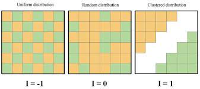

```{r setup, include=FALSE}
knitr::opts_chunk$set(warning = FALSE, message = FALSE, 
                      fig.retina = 3, fig.align = "center")

```


```{r packages-data, include=FALSE}
library(pander)
library(tidycensus)
library(sf)
library(tidyverse)
library(socviz)
library(maps)
library(plotly)
library(tmap)
library(spData)
library(raster)
library(maptools)
```
name: 1
class: center middle main-title section-title-4

# Quantifying Spatial Patterns

.class-info[

**Session 23**

.light[HES597: Introduction to Spatial Data in R<br>
Boise State University Human-Environment Systems<br>
Fall 2021]

]
---
# Today's objectives

* Introduce the concept of spatial patterns as realizations of _spatial processes_

* Demonstrate the use of expected values for evaluating a hypothesized process

* Introduce measures for characterizing spatial patterns

* Explore the concept of __scale__ and its implications for understanding spatial processes

---
name: process
class: center middle main-title section-title-4

# Patterns as process
---
# Description vs. process?

.pull-left[

* Vizualization and the detection of patterns

* The challenge of geographic data

* Implications for analysis 
]

.pull-right[
<figure>
  
</figure>
.caption[
Inequality in the United States: Quintiles of Gini Index by County: 2006–2010. The greater the Gini index, the more unequal a county’s income distribution is.
]
]
---
# Patterns as realizations of spatial processes

* A __spatial process__ is a description of how a spatial pattern might be _generated_

* __Generative models__ 

* An observed pattern as a _possible realization_ of an hypothesized process
---
# Deterministic vs. stochastic processes

.pull-left[
* Deterministic processes: always produces the same outcome

$$
z = 2x + 3y
$$
* Results in a spatially continuous field
]
.pull-right[
```{r detproc, echo=FALSE}
x <- raster::raster(nrows = 10, ncols=10, xmn = 0, xmx=10, ymn = 0, ymx=10)
a <- raster::rasterToPoints(x)
raster::values(x) <- 2*a[,1] + 3*a[,2]
plot(x)
```
]
---
# Deterministic vs. stochastic processes

.pull-left[

* Stochastic processes: variation makes each realization difficult to predict

$$
z = 2x + 3y + d
$$
* The _process_ is random, not the result (!!)
* Measurement error makes deterministic processes appear stochastic
]
.pull-right[
```{r stocproc, echo=FALSE}
x <- raster::raster(nrows = 10, ncols=10, xmn = 0, xmx=10, ymn = 0, ymx=10)
a <- raster::rasterToPoints(x)
d <- runif(ncell(x), -1,1)
raster::values(x) <- 2*a[,1] + 3*a[,2] + d
plot(x)
```
]
---
```{r stocproc2, echo=FALSE}
fun <- function(z){
a <- raster::rasterToPoints(z)
d <- runif(ncell(z), -2,2)
raster::values(z) <- 2*a[,1] + 3*a[,2] + d
return(z)
}

b <- replicate(n=6, fun(z=x), simplify=FALSE)
brk <-raster::brick(b)
plot(brk)

```
}
---
# Expected values and hypothesis testing

.pull-left[
* Considering each outcome as the realization of a process allows us to generate expected values

* The simplest spatial process is Completely Spatial Random (CSR) process

* __First Order__ effects: any event has an equal probability of occuring in a location

* __Second Order__ effects: the location of one event is independent of the other events
]
.pull-right[
<figure>
  
</figure>
.caption[
From Manuel Gimond
]
]
---
# Generating expactations for CSR

.pull-left[
```{r echo=FALSE}
load(url("https://github.com/mgimond/Spatial/raw/main/Data/ppa.RData"))

library(spatstat)
marks(starbucks)  <- NULL
Window(starbucks) <- ma
plot(starbucks, main=NULL, cols=rgb(0,0,0,.2), pch=20)
pop.lg <- log(pop)
Q <- quadratcount(starbucks, nx= 6, ny=3)
plot(starbucks, pch=20, cols="grey70", main=NULL)  # Plot points
plot(Q, add=TRUE)
Q.d <- intensity(Q)
starbucks.km <- rescale(starbucks, 1000, "km")
ma.km <- rescale(ma, 1000, "km")
pop.km    <- rescale(pop, 1000, "km")
pop.lg.km <- rescale(pop.lg, 1000, "km")
Q   <- quadratcount(starbucks.km, nx= 6, ny=3)
Q.d <- intensity(Q)
```
]
.pull-right[
* We can use quadrat counts to estimate the expected number of events in a given area

* The probability of each possible count is given by:
$$
P(n,k) = {n \choose x}p^k(1-p)^{n-k}
$$

* This becomes computationally exhausting...

]
---
name: tobler
class: center middle main-title section-title-4

# Tobler's Law
---
class: center middle

> ‘everything is usually related to all else but those which are near to each other
>are more related when compared to those that are further away’.
> `r tufte::quote_footer('Waldo Tobler')`

---
# Spatial autocorrelation

<figure>
  
</figure>
.caption[
From Manuel Gimond
]
---
# The challenge of areal data

* Spatial autocorrelation threatens _second order_ randomness

* Areal data means an infinite number of potential distances

* Neighbor matrices, $\boldsymbol W$, allow different characterizations


---
# (One) Measure of autocorrelation
.pull-left[
* Moran's I

<figure>
  
</figure>
]

.pull-right[
<figure>
  
</figure>
]
---
name: scale
class: center middle main-title section-title-4

# The importance of scale

---
# What do we mean by __scale__?

---
# Why might we care about scale?

---
# Implications of scale for understanding spatial processes

