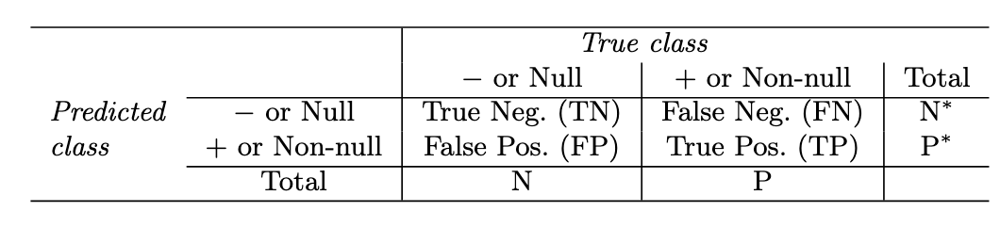
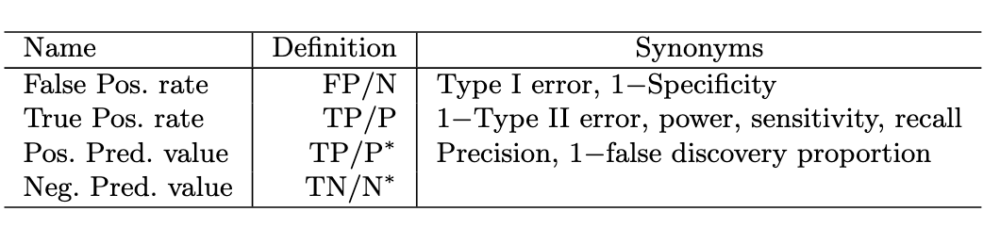

```{r setup, include=FALSE}
knitr::opts_chunk$set(warning = FALSE, message = FALSE, 
                      fig.retina = 3, fig.align = "center")

```


```{r packages-data, include=FALSE}
library(raster)
library(dismo)
library(sp)
library(rgdal) 
library(rgeos)
library(pander)
library(randomForest)
```

```{r simdata, echo=FALSE}
pred.files <- list.files(file.path(system.file(package="dismo"), 'ex'), pattern='grd$', full.names=TRUE )

pred.stack <- stack(pred.files)

pred.stack.crop <- crop(pred.stack, extent(-108, -95, 29,39))
pred.stack.crop <- pred.stack.crop[[1:7]]

pts <- sampleRandom(pred.stack.crop, 100, sp=TRUE)
pts <- pts[,-(1:8)]
pts.df <- extract(pred.stack.crop, pts, df=TRUE)
pts.df[,2:8] <- scale(pts.df[,2:8])

betas <- c(-0.05, 2, -1.5, 0.01, 0.8, -2.5, 1.25)
X <- as.matrix(pts.df[,2:8])

linpred <- -2 + X %*% betas

y.bern <- rbinom(100, 1, plogis(linpred))
y.bin <- rbinom(100, 5, plogis(linpred))
  
bern.final <- maptools::spCbind(pts, y.bern)
bin.final <- maptools::spCbind(pts, y.bin)

bin.df <- cbind(pts.df, bin.final@data$y.bin)
bern.df <- cbind(pts.df, bern.final@data$y.bern)
pres.pts <- bin.final[bin.final@data$y == 1,]
abs.pts <- bin.final[bin.final@data$y == 0,]
```

name: 1
class: center middle main-title section-title-4

# Evaluating Model Performance

.class-info[

**Session 29**

.light[HES597: Introduction to Spatial Data in R<br>
Boise State University Human-Environment Systems<br>
Fall 2021]

]
---

# For Today

* Revisit the models from Thursday

* Introduce methods for assessing model quality

* Wrap up the semester
---

# A quick revisit of our event occurrence models

__Goal__: To develop a statistical approach for classifying locations into those where an event (probably) occurs and those where it does not

__The challenge with linear models?__

---
# Logistic Regression

* The _probability_ of occurrence is modeled as:
$$
\begin{eqnarray}
y \sim \text{Bin}(p,n) \\
\\
\text{OR} \\
\\
y \sim \text{Bern}(p) \\ 
\\
\text{where}\\
\text{log}(\frac{p}{1-p}) = \mathbf{x}'\mathbf{\beta} + \alpha
\end{eqnarray}
$$

* And fit in R using:

```{r lgreg}
bin.reg <-  glm(cbind(y.bin, 5-y.bin) ~ bio1 + bio17+ bio5 + bio6, family = binomial(link="logit"), data=bin.df )
bern.reg <-  glm(y.bern ~ bio1 + bio17+ bio5 + bio6, family = binomial(link="logit"), data=bern.df )
```
---
# Statistical classifiers

* Random Forests - a bootstrapping approach for developing multiple 'decision trees' and synthesizing into a 'consensus' tree

```{r rf}
reg.model <- y.bern ~ bio1 + bio5 + bio6 +  bio12 + bio16 + bio17
rf1 <- randomForest(reg.model, data=bern.df)
```

* Maximum Entropy (MaxEnt) - maximize the difference (entropy) between the model and a null (uniform) surface

```{r maxent, message=FALSE}
maxent()
max.fit <- maxent(pred.stack, pres.pts, nbg=200)
```

---
name: theory
class: center middle main-title section-title-4

# Fit and Prediction
---
class: center middle main-title section-title-4

# What do we mean by "fit"?
---
# Model predictions vs observations

* Sum of Squared Error not possible for non-linear models

* Deviance - the difference between the model under consideration and _idealized, saturated_ model

* Related to the Likelihood Ratio Test

```{r dev}
null.bern <- glm(y.bern ~ 1, family = binomial(link="logit"), data=bern.df )
anova(bern.reg, null.bern)
```
---
# Also related to model selection approaches

* Based on Kullback-Liebler Information and Information Theory

* Penalized for complexity

* _AIC, DIC, BIC, WAIC_

```{r modsel}
AIC(bern.reg, null.bern)
```

---
# Challenges with deviance and model-selection approaches

* Restricted to actual observations (or theoretical assumptions)

* Allows comparison between _nested_ models

* Hard to compare statistical learning methods with more traditional model structures

---

name: confusion
class: center middle main-title section-title-4

# Threshold-based techniques

--- 

# Classification more generally

<figure>
  
</figure>
.caption[
From [James et al. 2020](https://hastie.su.domains/ISLR2/ISLRv2_website.pdf)
]

* Our interest is generally in how well our classifier performs

---
# But we may care about certain errors more than others!!

<figure>
  
</figure>
.caption[
From [James et al. 2020](https://hastie.su.domains/ISLR2/ISLRv2_website.pdf)
]

---
# A more general approach

* The Receiver Operating Characteristic Curve: Compares the False Positive Rate to True Positive Rate give a particular threshold

* The Area Under the Curve (AUC) score provides an estimate of the performance of a classifier under all possible threshold values


---
name: bootstrap
class: center middle main-title section-title-4

# Resampling-based techniques 